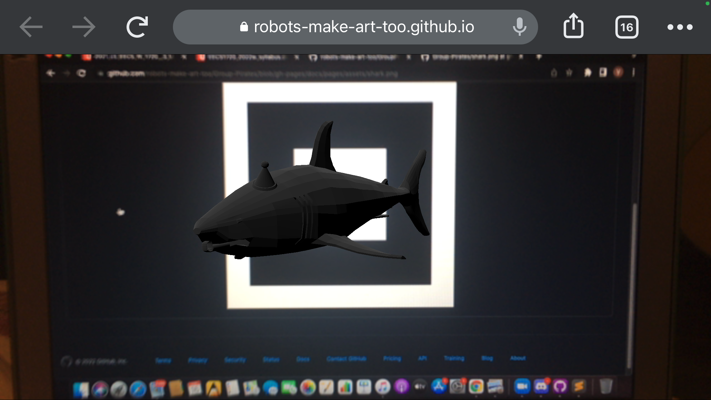

# Website and AR code!
[click here to see the main page of our website](https://robots-make-art-too.github.io/Group-Pirates/) or scan the qr code [here](https://github.com/robots-make-art-too/Group-Pirates/blob/gh-pages/docs/assets/markers/anchor-qr.png)

### structure

The website for this repo is built from:
1. `branch`: `gh-pages`
2. directory: `docs/`

### what's in this branch
* `docs` - contains the code for the gh page 
   * `_data` - `nav.yml` contains the links to the repo and organization page included in the header
   * `_includes` - separate code for repeated sections of the website
   * `_layouts` - templates for pages/posts 
   * `_plugins` - jekyll stuff 
   * `_posts` - the "posts" from the main page 
   * `assets` - css, icons, images, markers, models
   * `pages` - different pages that show up when the user scans the qr code on the poster 
     * *[WARNING] THESE PAGES CONTAIN SPOILERS AND ARE ONLY INTENDED TO BE SEEN AFTER THE USER REACHES THE LOCATION*
   * `ar-camera.html` - the site that uses the camera, detects the marker, displays the models
   * `404.md` - error page
   * `about.md` - about page
   * `_config.yml` - the theme
   * `index.md` - main landing page, uses the default layout
* `phase2_content` - older phase 2 content that is not in use

### documentation (from phase 2)

Screenshot of our live AR scene through phone:

Video of live AR scene through computer:

https://user-images.githubusercontent.com/90432401/158530339-536d04c4-e6ff-4201-994e-f6c0d0075c2f.mov

